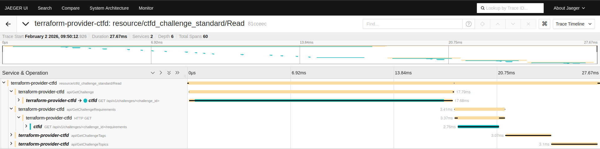

# Example - OpenTelemetry

As the provider supports OpenTelemetry, this example shows how to technically use it in a demo environment.

## Try it out!

- Run an OpenTelemetry Collector to capture signals (here we focus on traces), Jaeger for distributed traces visualization, our [instrumented and repackaged CTFd](https://github.com/ctfer-io/ctfd-packaged) for OpenTelemetry support, and [`ctfd-setup`](https://github.com/ctfer-io/ctfd-setup) for bootstrapping.
    ```bash
    docker compose up -d
    ```

- Initialize the Terraform setup.
    ```bash
    terraform init
    ```

- Setup the environment variables for the provider to pick up its configuration.
    ```bash
    export OTEL_EXPORTER_OTLP_ENDPOINT=dns://localhost:4317
    export OTEL_EXPORTER_OTLP_INSECURE=true
    export CTFD_URL=http://localhost:8000
    export CTFD_ADMIN_USERNAME=ctfer
    export CTFD_ADMIN_PASSWORD=ctfer
    ```

- Use it! :smile:
    ```bash
    terraform apply -auto-approve
    ```

- You can also run the acceptance tests of the TF provider :thinking:
    ```bash
    (
        cd ../..
        TF_ACC=1 go test ./provider/ -v -run=^TestAcc_
    )
    ```

- Open Jaeger and visualize traces: [`http://localhost:16686`](http://localhost:16686)
<div align="center">
    
</div>

- You can delete the infra :wink:
    ```bash
    terraform destroy -auto-approve
    docker compose down -v
    ```
